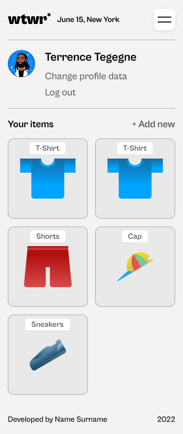
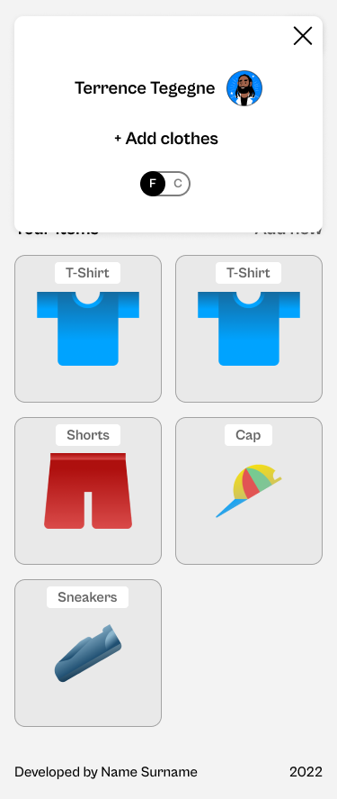
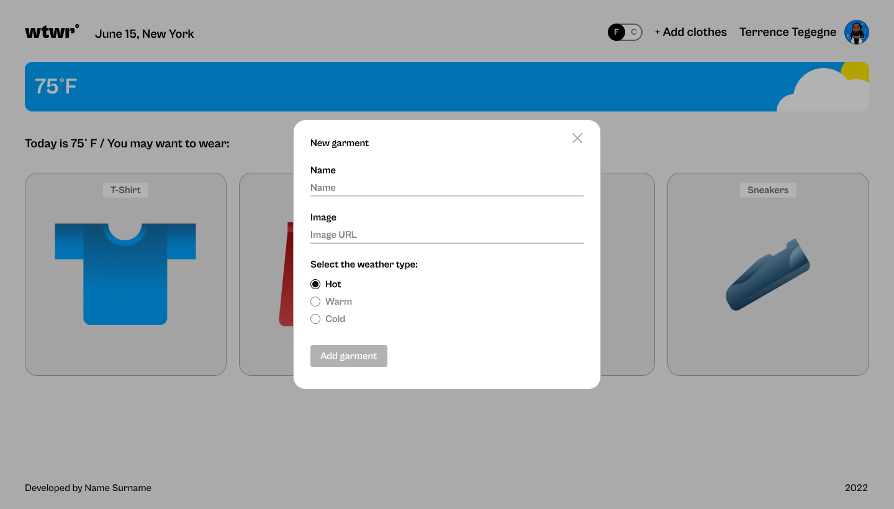
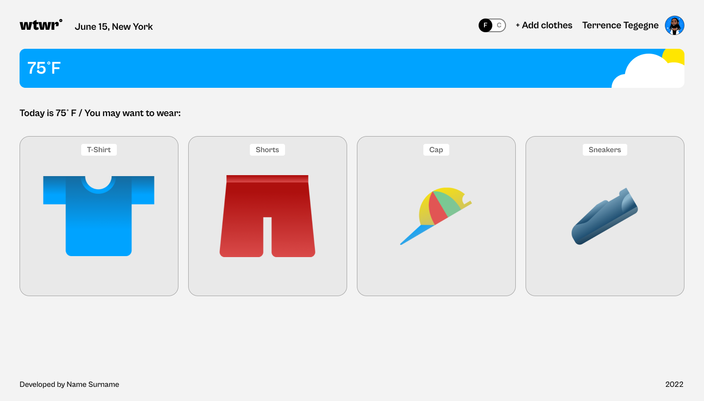
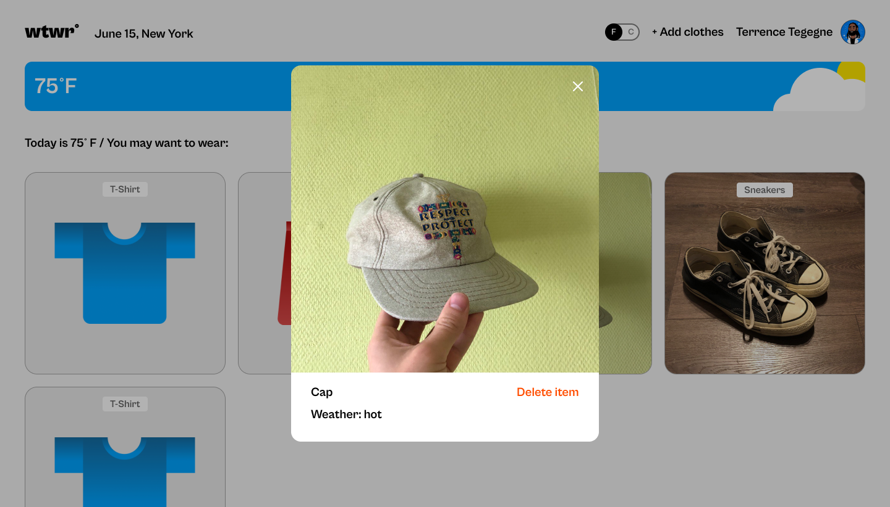

# WTWR (What to Wear?)

## About the Project

The idea is simple: we fetch the daily weather forecast from an API, process the data, and then recommend clothing based on the current weather conditions. This project is designed to demonstrate core React concepts like state, effects, context, routing, and more.

## Table of Contents

- [About the Project](#about-the-project)
- [React Concepts](#react-concepts-used)
- [Figma Design](#figma-design)
- [Screenshots](#screenshots)
- [Tech Stack](#tech-stack)
- [Future Improvements](#future-improvements)

---

## React Concepts Used

### State & Props

- The app uses `useState` to manage key UI and app data like temperature units, modals, selected items, loading state, and API results.
- Props are used to pass data from parent to child components (prop drilling).

### Side Effects with `useEffect`

- `useEffect` handles:
  - API requests (weather and clothing items).
  - DOM event listener registration and cleanup.
- The dependency array controls when effects run. An empty array (`[]`) means “run only once on mount.”

**Weather fetch on mount:**

```js
useEffect(() => {
  getWeatherData(coordinates, apiKey)
    .then((data) => {
      if (data) {
        const weatherData = filterWeatherData(data);
        setWeather(weatherData);
        setTimeout(() => setIsLoading(false), 1000); // Smooths out initial loading flash
      }
    })
    .catch((error) => {
      setIsLoading(false);
      console.error("Failed to fetch data:", error);
    });
}, []);
```

**Event listener cleanup:**

```js
useEffect(() => {
  if (activeModal) {
    document.addEventListener("keyup", handleEscClose);
    document.addEventListener("click", handleOverlayClick);
  }

  return () => {
    document.removeEventListener("keyup", handleEscClose);
    document.removeEventListener("click", handleOverlayClick);
  };
}, [activeModal]);
```

### React Context

- The `CurrentTemperatureUnitContext` provides global state for Fahrenheit/Celsius toggle.
- This prevents unnecessary prop drilling and makes unit switching available anywhere in the component tree.

### Custom Hook: `useForm`

A custom hook is used to simplify form state management.

```js
import { useState } from "react";

function useForm(defaultValues) {
  const [values, setValues] = useState(defaultValues);

  const handleChange = (e) => {
    const { name, value } = e.target;
    setValues({ ...values, [name]: value });
  };

  return { values, setValues, handleChange };
}

export default useForm;
```

- Reusable across all forms.
- Helps keep form input logic clean and declarative.

### Routing with React Router

- The app uses `react-router-dom` to support multiple views (`/` for Main and `/profile` for Profile).
- Routes are defined using `<Routes>` and `<Route>`, and navigation is handled via `<Link>` components.

## Figma Design

- [Original design](https://www.figma.com/file/DTojSwldenF9UPKQZd6RRb/Sprint-10%3A-WTWR)

## Screenshots

| Mobile Profile                                                                 | Mobile Menu                                                                  |
| ------------------------------------------------------------------------------ | ---------------------------------------------------------------------------- |
|  |  |

Add clothes form



1440px Resolution



Garment Modal



## Tech Stack

- **Frontend:** React, React Router
- **State Management:** React Context + useState
- **Data Fetching:** Fetch API with async handling
- **Styling:** CSS
- **Design:** Figma
- **Weather API:** OpenWeatherMap

---

## Future Improvements

- Add user authentication
- Replace mock data with a real MongoDB backend
