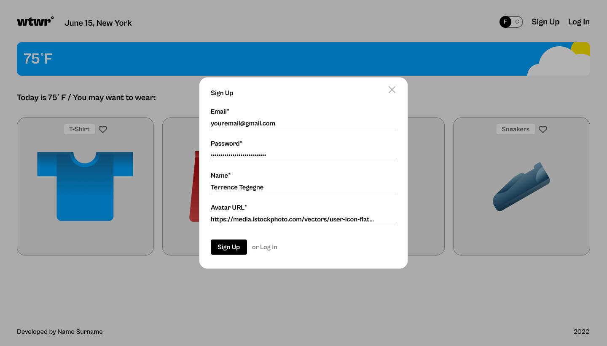

# WTWR (What to Wear?)

Weather-aware outfits, powered by React and an Express API.

**Now Live on GCP! Scroll down for more info.**

## About the Project

### The idea is simple: we fetch the daily weather forecast from an API, process the data, and then recommend clothing based on the current weather conditions. This project is designed to demonstrate core React concepts like state, effects, context, routing, and more.

### Features

🔐 JWT authentication & protected routes

👕 CRUD for clothing items (likes included)

🌦️ Live weather via OpenWeatherMap (F/°C toggle)

📱 Responsive UI with accessible modals

## Table of Contents

- [About the Project](#about-the-project)
- [Accessing the Application](#accessing-the-application)
- [Install WTWR as a PWA](#install-wtwr-as-a-pwa)
- [Latest updates](#latest-updates)
- [React Concepts](#react-concepts-used)
- [Backend API](#backend-api)
- [Figma Design](#figma-design)
- [Screenshots](#screenshots)
- [Tech Stack](#tech-stack)
- [Future Improvements](#future-improvements)

---

## Accessing the Application

**Production domain (frontend app):** https://wtwr.host2go.net

**Backend GitHub repo:** https://github.com/RyanZomparelli/se_project_express

**API base URL (backend):** https://api.wtwr.host2go.net

## 🎥 Project Pitch Videos

Check out these videos, where I describe my project
and some challenges I faced while building it:

- **UI & Frontend Overview (7 min):** https://youtu.be/rKyM2rYG5Po
- **Backend & API Overview (5 min):** Coming soon

## Install WTWR as a PWA

The WTWR application can be installed as a PWA (Progressive Web App) on your phone. This means it behaves almost exactly like a native app that you'd download from an app store.

**Android | Chrome**

1. Open this page in Chrome.

2. Tap the menu icon (three vertical dots in the upper right corner).

3. Select “Add to Home Screen.”

4. Give your shortcut a name (or use the default), and tap Install or Add.

The icon will now appear on your home screen.

**iPhone | Safari**

Open this page in Safari.

1. Look at the bottom navigation toolbar and tap the Share icon — it’s the rectangle with an upward arrow.

2. A menu will slide up from the bottom. Swipe through the options until you find “Add to Home Screen.”

3. Tap it, give your icon a name (or leave the default), and tap Add.

## Latest Updates

### Now fully deployed on GCP.

Check out the sections above, _Accessing the Application_, and/or _Install WTWR as a PWA_ to see how to access the app!

### Now using my Express.js app as the back-end API!

- Supports user authentication/authorization.
- Manages app-wide CRUD operations for users and clothing cards.

Click the link to check it out:

- [WTWR API GitHub repo](https://github.com/RyanZomparelli/se_project_express)

Registration Modal on the non protected home route.



---

## React Concepts Used

### State & Props

- The app uses `useState` to manage key UI and app data like temperature units, modals, selected items, loading state, and API results.
- Props are used to pass data from parent to child components (prop drilling).

### Side Effects with `useEffect`

- `useEffect` handles:
  - API requests (weather and clothing items).
  - DOM event listener registration and cleanup.
- The dependency array controls when effects run. An empty array (`[]`) means “run only once on mount.”

**Weather fetch on mount:**

```js
useEffect(() => {
  getWeatherData(coordinates, apiKey)
    .then((data) => {
      if (data) {
        const weatherData = filterWeatherData(data);
        setWeather(weatherData);
        setTimeout(() => setIsLoading(false), 1000); // Smooths out initial loading flash
      }
    })
    .catch((error) => {
      setIsLoading(false);
      console.error("Failed to fetch data:", error);
    });
}, []);
```

**Event listener cleanup:**

```js
useEffect(() => {
  if (activeModal) {
    document.addEventListener("keyup", handleEscClose);
    document.addEventListener("click", handleOverlayClick);
  }

  return () => {
    document.removeEventListener("keyup", handleEscClose);
    document.removeEventListener("click", handleOverlayClick);
  };
}, [activeModal]);
```

### React Context

- The `CurrentTemperatureUnitContext` provides global state for Fahrenheit/Celsius toggle.
- This prevents unnecessary prop drilling and makes unit switching available anywhere in the component tree.

### Custom Hook: `useForm`

A custom hook is used to simplify form state management.

```js
import { useState } from "react";

function useForm(defaultValues) {
  const [values, setValues] = useState(defaultValues);

  const handleChange = (e) => {
    const { name, value } = e.target;
    setValues({ ...values, [name]: value });
  };

  return { values, setValues, handleChange };
}

export default useForm;
```

- Reusable across all forms.
- Helps keep form input logic clean and declarative.

### Routing with React Router

- The app uses `react-router-dom` to support multiple views (`/` for Main and `/profile` for Profile).
- Routes are defined using `<Routes>` and `<Route>`, and navigation is handled via `<Link>` components.

## Backend API

The app uses my Express API:

Repo: https://github.com/RyanZomparelli/se_project_express

Endpoints (sample):

- POST /signup – create user

- POST /signin – get JWT

- GET /users/me – current user (auth)

- GET /items – list clothing items

- POST /items – create (auth)

- PUT /items/:id/likes / DELETE /items/:id/likes – like/unlike (auth)

- DELETE /items/:id – owner only

## Figma Design

- [Original design](https://www.figma.com/file/DTojSwldenF9UPKQZd6RRb/Sprint-10%3A-WTWR)
- [Latest design](https://www.figma.com/design/bfVOvqlLmoKZ5lpro8WWBe/Sprint-14_-WTWR?node-id=0-1&p=f&t=Xc9CgXVm1ME3OSbW-0)

## Screenshots

| Mobile Profile                                                                 | Mobile Menu                                                                  |
| ------------------------------------------------------------------------------ | ---------------------------------------------------------------------------- |
|  |  |

Add clothes form


1440px Resolution


Garment Modal


## Tech Stack

**Frontend**

- React (Vite)
- React Router
- Context API
- Fetch API
- CSS (custom)
- ESLint (Vite config)

**Backend / API**

- Node.js + Express
- RESTful routes (items, auth, profile)

**Database**

- MongoDB
- Mongoose (schemas, validation)

**Auth & Security**

- JWT (jsonwebtoken) for auth
- bcryptjs for password hashing
- Protected routes
- Basic input validation (server-side)

**External Services**

- OpenWeatherMap (current weather)

**Tooling & DX**

- npm scripts (`dev`, `build`, `preview`, `lint`)
- Vite dev server + HMR
- GitHub for version control/PRs

---

## Future Improvements

- Cloud Deployment!
- Tests
